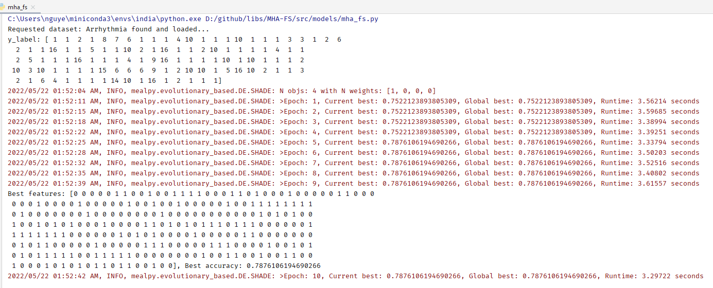
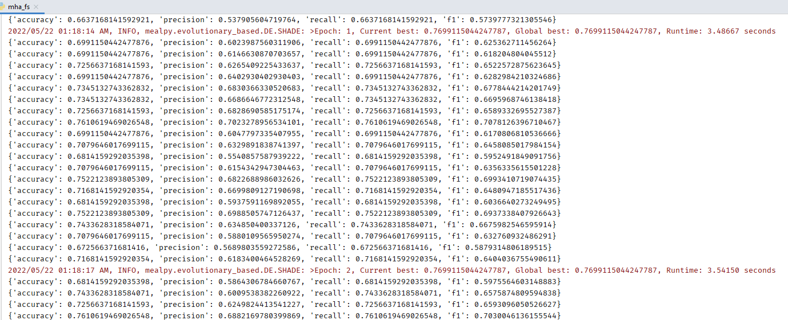

# Feature Selection using Meta-Heuristic Algorithms (MEALPY)

This is currently the largest library for Feature Selection problems.
More algorithms than this package: https://github.com/Ritam-Guha/Py_FS

```code 
+ Cleaner code and shorter code 
+ More Meta-Heuristic Algorithms / nature-inspred evolutionary 
+ Can use multiple metrics to select features 
```

# Usage

## Dependencies 

1. Mealpy (https://github.com/thieu1995/mealpy)
2. Permetrics (https://github.com/thieu1995/permetrics)

## Setup environments

### Pip 
```code 
pip install numpy, scikit-learn
pip install mealpy==2.5.0
pip install permetrics==1.3.0
```

### Conda 
```code 
conda create -n ml python==3.7.5
conda activate ml
conda install -c conda-forge numpy, scikit-learn
pip install mealpy==2.5.0
pip install permetrics==1.3.0
```


# Examples

Run the file: src/models/mha_fs.py 


### Notes: 

```code

1. The format of solution / position 

- Because we need to select the best features in dataset.

So a solution is a 1-D vector, each dimension represent an index of column in dataset. 
    + If it has value 1, meaning this column is selected for the model
    + If it has value 0, meaning this column is not selected for the model

2. Why upper bound is 1.99 and lower bound is 0.0

- Because our range of variables in solution either 0 or 1. But the algorithm create a real-value variables. 
So we need to convert real-value back into integer value (0 and 1). 
    + That is why the lower bound is 0 for all dimensions (floor of 0 is 0)
    + The upper bound is 1.99 for all dimensions (floor of 1.99 is 1)

Also if all the dimensions have value 0, meaning no column is selected --> Can't run the model 
    + So we need to select a random column for the model

3. Fitness function 

- Use the classifier object to build a classification model with the selected model (KNN, or Random forrest or SVM) 
and calculate the metrics such as accuracy, precision, recall and f1. 

- You can define your own classifier at src/models/classifiers.py

- Set the obj_weights to 1 if you interested in selected metric 

- In the current example, accuracy metric is selected, so the weight for accuracy is 1 and other metrics are 0. 
Beside, this problem will be maximization problem (we want the maximum accuracy = 100%)

4. Use different algorithm

- Select your own optimizer by classname in config.py. 
- See the classname in here: https://mealpy.readthedocs.io/en/latest/pages/support.html#classification-table

5. Setting

- Everything needs to config is located at: src/config.py 

```








### Cite Us

* If this code is useful for you, please give me some credits, [link](https://gist.github.com/thieu1995/2dcebc754bf0038d0c12b26ec9d591aa) to my papers.

```code 
@software{nguyen_van_thieu_2022_6684223,
  author       = {Nguyen Van Thieu and Seyedali Mirjalili},
  title        = {{MEALPY: a Framework of The State-of-The-Art Meta-Heuristic Algorithms in Python}},
  month        = jun,
  year         = 2022,
  publisher    = {Zenodo},
  version      = {v2.4.2},
  doi          = {10.5281/zenodo.6684223},
  url          = {https://doi.org/10.5281/zenodo.6684223}
}
```
